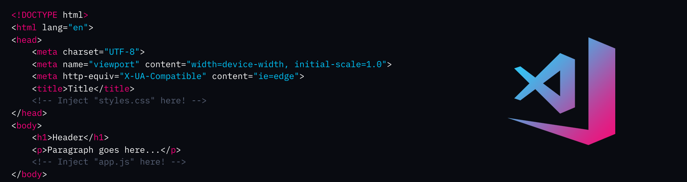

# DevWars Theme - VS Code



A Visual Studio Code theme for all the DevWars fans out there. ✨

# Installation

1.  Install [Visual Studio Code](https://code.visualstudio.com/)
2.  Launch Visual Studio Code
3.  Choose **Extensions** from menu
4.  Search for `DevWars`
5.  Click **Install** to install it
6.  Click **Reload** to reload the Code
7.  From the menu bar click: Code > Preferences > Color Theme > **DevWars**

## Preferences shown in the preview

The font in the preview image is Roboto, [available here](https://fonts.google.com/specimen/Roboto):

```
"editor.fontFamily": "Roboto",
```
